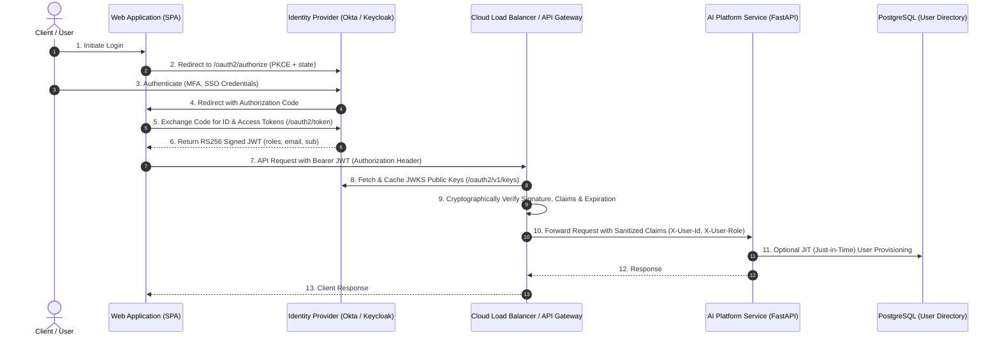
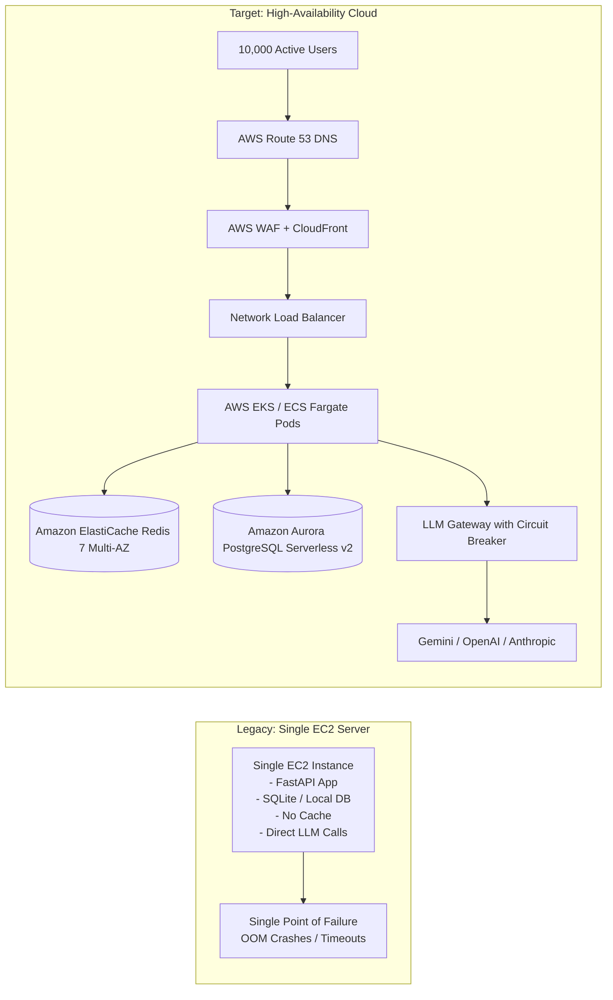
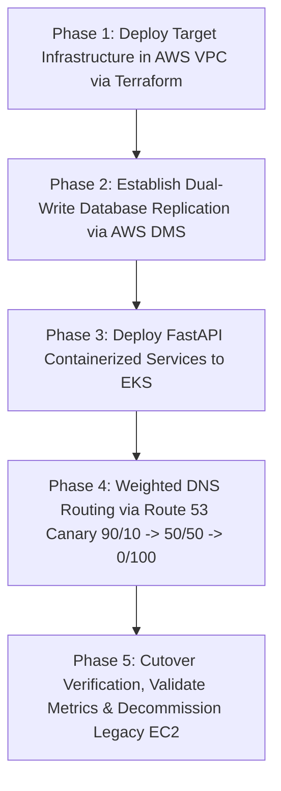

# AI/LLM Platform & DevOps Architecture Specification

This document provides in-depth architectural analyses, mathematical scaling proofs, failure mode analyses, and migration roadmaps for the AI Question-Answering Platform.

---

## 1. Enterprise SSO / OIDC Architecture & RBAC (Section 2)

### 1.1 Production SSO / OIDC Flow

In an enterprise environment, static JWT generation is transitioned to an OpenID Connect (OIDC) / OAuth 2.0 federated identity provider (IdP) such as Okta, Keycloak, or Microsoft Entra ID (Azure AD).



#### Key Architecture Principles:
1. **Asymmetric Cryptography (RS256/ES256):** The IdP signs JWTs with a private key. The API Gateway and FastAPI service verify tokens against the IdP’s public JSON Web Key Set (`JWKS`), cached in memory with a 24-hour TTL and automated rotation.
2. **Offloading at API Gateway:** Token signature verification, rate limiting, and coarse authorization are terminated at the API Gateway (Kong, Envoy, or AWS API Gateway), protecting backend FastAPI instances from signature verification overhead.
3. **Decoupled Identity Claims:** Tokens carry standardized claims (`iss`, `aud`, `sub`, `roles`, `groups`), allowing zero-round-trip authorization inside microservices.

### 1.2 Role-Based Access Control (RBAC) Matrix

| Capability / Endpoint | Admin | User | Read-Only |
| :--- | :---: | :---: | :---: |
| `POST /auth/login` & `/auth/register` | ✅ Full | ✅ Self | ❌ Blocked |
| `GET /auth/me` | ✅ Self | ✅ Self | ✅ Self |
| `POST /chat` (LLM Generation) | ✅ Unrestricted | ✅ Rate-Limited | ❌ Forbidden (403) |
| `GET /health` (Deep Probes) | ✅ Full Diagnostic | ✅ Basic | ✅ Basic |
| `GET /metrics` (Prometheus Scrape) | ✅ Full | ❌ Forbidden (403) | ❌ Forbidden (403) |
| System Configuration & User Admin | ✅ Full | ❌ Forbidden (403) | ❌ Forbidden (403) |
| Audit Logs & Cost Reports | ✅ Full (Tenant-wide)| ❌ Forbidden (403) | ✅ Read-Only (Auditor) |

---

## 2. High-Throughput Scaling: 100 to 500 RPS (Section 4)

### 2.1 Concurrency & Capacity Math

Let us calculate the required compute footprint at **500 RPS** with realistic LLM latency:

- **Target Throughput (R):** 500 req/sec
- **Cache Hit Ratio (C):** 35% (served from Redis in < 5ms)
- **Uncached Requests (R_llm):** `500 * (1 - 0.35) = 325 req/sec`
- **Upstream LLM p95 Latency (L):** 2.0 seconds
- **Little's Law (N = R * L):**
  ```text
  N_in_flight = 325 req/sec * 2.0s = 650 concurrent in-flight connections
  ```

#### Worker & Pod Calculation:
- An asynchronous FastAPI worker running on Uvicorn with `uvloop` can safely maintain **50 concurrent non-blocking I/O connections** without event-loop saturation or memory degradation.
- **Concurrent workers required:** `650 / 50 = 13 workers`
- **Running 2 workers per pod on 0.5 vCPU / 512MiB RAM:**
  ```text
  Pods Required (Baseline) = ceil(13 / 2) = 7 pods
  ```
- **Applying an enterprise N+2 redundancy factor and headroom for CPU spikes (60% target CPU):**
  ```text
  Recommended Autoscaling Scale Target = 12 to 20 pods
  ```

```mermaid
graph TD
    subgraph Traffic Ingress
        Client[Users / Apps - 100 to 500 RPS] --> Cloudflare[Cloudflare WAF / DDoS Protection]
        Cloudflare --> ALB[AWS Application Load Balancer / NGINX Ingress]
    end

    subgraph Kubernetes Cluster (Autoscaled)
        ALB --> Service[K8s Service: ClusterIP]
        Service --> Pod1[FastAPI Pod 1]
        Service --> Pod2[FastAPI Pod 2]
        Service --> PodN[FastAPI Pod N (HPA: 3-30 Pods)]
        HPA[Kubernetes HPA<br/>CPU > 60% / Redis Queue Depth] -.-> PodN
    end

    subgraph Caching & State Layer
        Pod1 & Pod2 & PodN --> RedisCluster[(Redis 7 Cluster<br/>Primary-Replica)]
        Pod1 & Pod2 & PodN --> PG[(PostgreSQL Aurora Multi-AZ<br/>Writer + 2 Read Replicas)]
    end

    subgraph Resilient Gateway & External Providers
        Pod1 & Pod2 & PodN --> GW[Resilient LLM Gateway]
        GW -->|Primary: gemini-3.6-flash| Gemini[Google Gemini API]
        GW -.->|Circuit Breaker OPEN| Fallback[Fallback: gemini-3.5-flash]
    end
```

### 2.2 Scaling Components & Mitigation Strategies

1. **Load Balancing & Health Checks:**
   - Layer 7 ALB distributes load using `least_outstanding_requests` (least connections) rather than round-robin, ensuring pods handling slow 4-second queries do not receive new requests while pods serving instant cache hits remain free.
   - Separate Kubernetes probes: `startupProbe` (5s), `readinessProbe` (fails out of load balancer within 10s of Redis disruption), and `livenessProbe` (restarts deadlock pods).

2. **Kubernetes HPA Configuration:**
   - Scales on dual metrics: CPU utilization (60%) and custom metrics via Prometheus Adapter (`rate(http_requests_total[1m])`).
   - Scale-up policy is aggressive (100% pod expansion every 15s) to catch traffic surges; scale-down stabilization window is set to 300s (5 minutes) to avoid thrashing.

3. **Redis Cluster (Caching & Distributed Rate Limiting):**
   - Redis operates in a 3-node master + 3-node read-replica cluster with Redis Sentinel.
   - Cache reads are routed to read-replicas, while rate-limit atomic sliding window increments (`ZADD`/`ZREMRANGEBYSCORE`) execute against masters.
   - Redis failure fallback: **fail-open** ensures the platform remains available even if the cache crashes.

4. **Handling LLM Provider Quotas (RPM, TPM & Concurrency Limits):**
   - External providers enforce strict rate limits (e.g., Tier 4 limits: 10,000 RPM, 1,000,000 TPM).
   - Client-side token bucket in Redis throttles requests before they leave our network.
   - Batching & Asynchronous Offloading: Non-interactive queries (summaries, indexing) are pushed to an asynchronous Celery/ARQ queue backed by Redis, preserving synchronous capacity for interactive conversational requests.

---

## 3. Production Architecture & Migration: 10 to 10,000 Users (Section 5)

### 3.1 Architecture Comparison



### 3.2 Key Production Components

| Component | Legacy Architecture | Target Production Architecture | Justification & Trade-offs |
| :--- | :--- | :--- | :--- |
| **Compute** | 1x EC2 Instance (t3.medium) | AWS EKS (Kubernetes) or ECS Fargate | Autoscaling, self-healing, rolling deployments, zero single point of failure. |
| **Database** | Local SQLite / Local Postgres | Amazon Aurora PostgreSQL Multi-AZ | Automated backups, read replicas, storage autoscaling up to 128TiB, 99.99% SLA. |
| **Cache & Limiter**| In-memory Python dictionaries | Amazon ElastiCache for Redis (Cluster Mode) | Distributed state shared across all pods; survives pod restarts; sub-millisecond latencies. |
| **Secrets** | Hardcoded `.env` files on disk | AWS Secrets Manager + HashiCorp Vault | Automated key rotation, strict IAM roles, audit logs of secret access, no secrets on disk. |
| **Observability** | Standard console print/logs | OpenTelemetry + Prometheus + Grafana + Datadog | Real-time distributed tracing, p99 latency alerts, token cost dashboards, circuit breaker alerts. |

---

## 4. Zero-Downtime Migration Strategy



### Phase 1: Infrastructure Provisioning via IaC (Terraform)
- Provision Multi-AZ VPC, EKS Cluster, Aurora Serverless v2, ElastiCache Redis, and AWS Secrets Manager.
- Ensure private subnets with NAT Gateways for outbound LLM API access.

### Phase 2: Data Migration & Synchronization
- Execute initial PostgreSQL dump and restore to Aurora.
- Deploy **AWS Database Migration Service (DMS)** with Change Data Capture (CDC) to continuously replicate changes from legacy EC2 to Aurora in real-time until replication lag reaches < 100ms.

### Phase 3: Canary Traffic Routing (Route 53 Weighted Records)
- **Day 1:** 90% legacy EC2, 10% EKS cluster. Monitor Prometheus error rates, latency, and DB connections.
- **Day 2:** 50% legacy, 50% EKS cluster.
- **Day 3:** 100% EKS cluster.

### Phase 4: Rollback Strategy
- Keep AWS DMS bi-directional or keep legacy EC2 on warm standby for 48 hours. If EKS error rate exceeds 1%, Route 53 immediately swings 100% traffic back to EC2 with zero data loss.

---

## 5. Resilience & Failure Mode Analysis

| Failure Scenario | Immediate Detection | System Response | End-User Impact |
| :--- | :--- | :--- | :--- |
| **Primary LLM Provider Outage (503 / 504)** | Consecutive failures detected by Circuit Breaker | 1. Backoff retry (3 attempts with jitter)<br/>2. Failover to secondary model (`gemini-3.5-flash`)<br/>3. Trip Circuit Breaker to `OPEN` | Minor change in output style; 0 downtime; 0 dropped requests. |
| **Provider Rate Limit (HTTP 429)** | Status code 429 classified as retryable | Exponential backoff with randomized jitter; Redis rate limiter tightens outbound admission | Latency increases by 200–500ms; requests succeed without errors. |
| **Redis Cluster Disruption** | Redis connection timeout (2s) | Platform **fails open**: skips cache, defaults to stateless rate limit, issues warning log | Cache misses increase LLM calls; platform remains 100% operational. |
| **Database Pool Exhaustion** | SQLAlchemy async pool timeout | Backpressure applied; health check flips to 503; ALB diverts traffic away from degraded pod | Upstream requests routed to healthy pods; zero cascading crash. |
