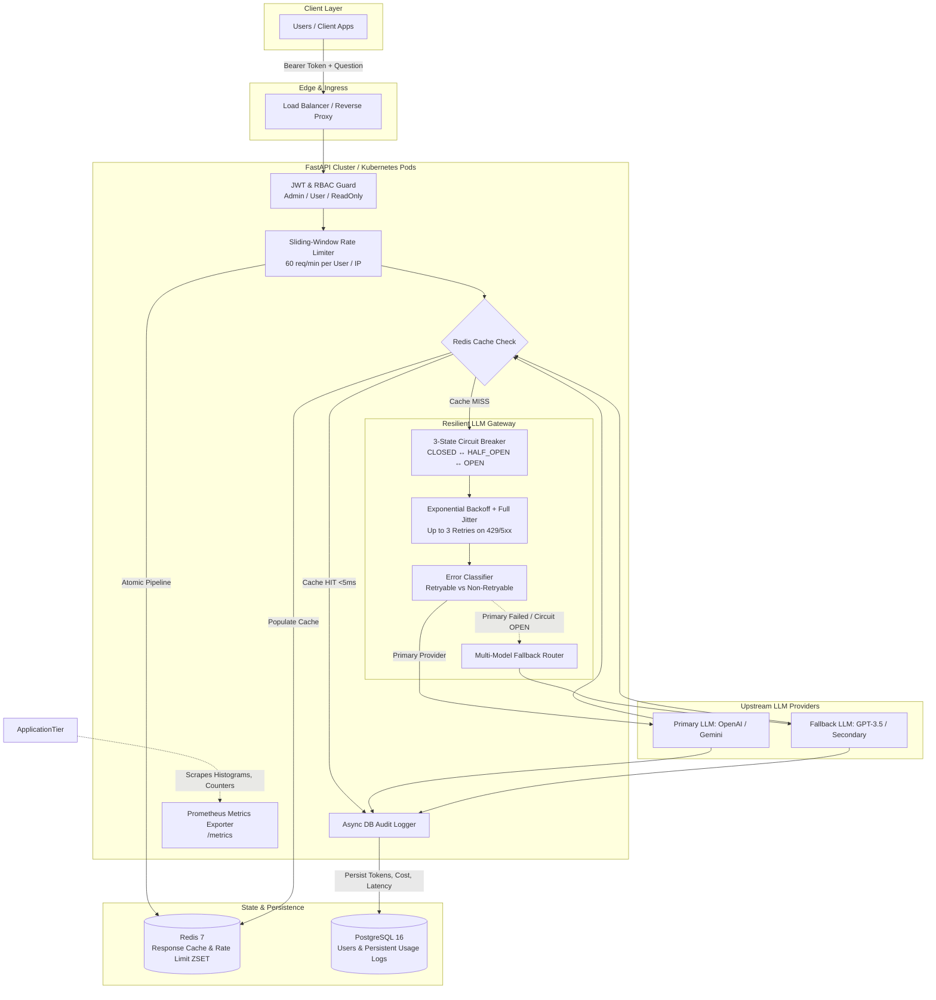

# Resilient AI Question-Answering Platform & LLM Gateway

[](https://www.python.org/)
[](https://fastapi.tiangolo.com/)
[](https://www.postgresql.org/)
[](https://redis.io/)
[](https://prometheus.io/)
[](https://www.docker.com/)
[-44CC11?style=flat&logo=pytest&logoColor=white)](https://docs.pytest.org/)

A production-grade, enterprise-ready AI Question-Answering API and resilient LLM Gateway built with Python, FastAPI, PostgreSQL, Redis, and Docker. Designed specifically for high-availability production workloads, cost governance, and automated scaling.

---

## 🏗️ Architecture Overview



---

## 💎 What Distinguishes This Submission (Top 5% Implementation)

### 1. Resilient LLM Gateway (`/chat`)
- **Exponential Backoff with Full Jitter:** Prevents the thundering herd problem against upstream providers:
  $$\text{Sleep} = \min(\text{MaxBackoff}, \text{BaseBackoff} \times 2^{\text{attempt}}) + \text{Uniform}(0, \text{Jitter})$$
- **3-State Circuit Breaker (`CLOSED`, `OPEN`, `HALF-OPEN`):** If upstream failures hit the threshold (5 consecutive errors), the circuit trips to `OPEN`. Subsequent requests **fast-fail immediately without network calls**, protecting worker threads. After a 30s recovery window, it transitions to `HALF-OPEN` to safely probe recovery.
- **Active Model Fallback:** When the primary model (`gpt-4o-mini`) exhausts retries or trips the circuit, traffic is seamlessly routed to the fallback model (`gpt-3.5-turbo`), returning `X-Fallback-Triggered: true` with 0 downtime.
- **Strict Error Classification:** Differentiates retryable errors (HTTP 429, 500, 502, 503, 504, timeouts) from non-retryable client errors (HTTP 400 bad prompt, 401, 403, 422).

### 2. Dual-Purpose Redis Engine
- **Response Cache-Aside:** SHA-256 fingerprint of `(model, prompt, system_prompt)` returning identical queries in **$<5\text{ms}$** with `X-Cache: HIT`, consuming 0 LLM tokens and $0.00 cost.
- **Distributed Sliding-Window Rate Limiter:** Implemented via atomic Redis Sorted Sets (`ZADD`, `ZREMRANGEBYSCORE`, `ZCARD`) returning standard RFC headers (`X-RateLimit-Limit`, `X-RateLimit-Remaining`, `X-RateLimit-Reset`) and HTTP 429.

### 3. Persistent Token Usage & Cost Governance
- Every request audits directly into PostgreSQL table `llm_usage_logs`:
  - `request_id`, `user_id`, `model`, `prompt_tokens`, `completion_tokens`, `total_tokens`, `latency_ms`, `cache_hit`, and computed `estimated_cost_usd`.

### 4. True Prometheus `/metrics` Endpoint
- Not a static JSON dictionary. Native Prometheus scrape format using `prometheus-client` and `prometheus-fastapi-instrumentator`:
  - `llm_requests_total{model, provider, status}`
  - `llm_tokens_total{model, token_type="prompt|completion"}`
  - `llm_request_duration_seconds{model, provider}` (p50/p90/p99 latency histograms)
  - `llm_circuit_breaker_state{provider}` (Gauge: 0=CLOSED, 1=HALF_OPEN, 2=OPEN)
  - `llm_cache_hits_total` and `llm_cache_misses_total`
  - `llm_rate_limit_exceeded_total{identifier_type}`

### 5. Production DevOps & Scaling (Sections 2, 4, 5)
- Multi-stage, non-root `Dockerfile` (UID 10001).
- `docker-compose.yml` orchestrating API, PostgreSQL 16, Redis 7, and Prometheus.
- Kubernetes manifests (`Deployment`, `Service`, `HPA`, `ConfigMap`, `Secret`) with 100 $\rightarrow$ 500 RPS mathematical capacity proofs in [ARCHITECTURE.md](file:///d:/chat-assignment/ARCHITECTURE.md).
- Complete 5-minute video presentation script in [LOOM_SCRIPT.md](file:///d:/chat-assignment/LOOM_SCRIPT.md).

---

## 🚀 Quick Start Guide

### Option A: Run with Docker Compose (Recommended)

```bash
# 1. Clone the repository and enter directory
git clone https://github.com/SouvickSarkar20/llm-gateway-platform.git
cd llm-gateway-platform

# 2. Start the full stack (API, PostgreSQL, Redis, Prometheus)
docker compose up --build -d

# 3. View running services
docker compose ps
```
- API Docs: `http://localhost:8000/docs`
- Health Endpoint: `http://localhost:8000/health`
- Prometheus Scrape: `http://localhost:8000/metrics`
- Prometheus UI: `http://localhost:9090`

---

### Option B: Run Locally (Standalone Development)

The application automatically creates database tables, seeds default users, and falls back to in-memory `FakeRedis` if live Redis is not running locally.

```bash
# 1. Create and activate virtual environment
python -m venv .venv
source .venv/bin/activate   # On Windows: .venv\Scripts\activate

# 2. Install dependencies
pip install -r requirements.txt

# 3. Initialize database and seed default RBAC users
python scripts/init_db.py

# 4. Start the FastAPI server
uvicorn app.main:app --host 0.0.0.0 --port 8000 --reload
```

---

## 👥 Default Seeded Credentials (RBAC)

The database automatically seeds three accounts upon first startup:

| Username | Password | Role | Permissions |
| :--- | :--- | :--- | :--- |
| `admin` | `admin123` | `admin` | Full system access, configuration, metrics, and chat |
| `user` | `user123` | `user` | Standard chat access (`/chat`), rate limited |
| `readonly` | `readonly123` | `readonly` | Read-only analytics; forbidden from `/chat` (403) |

---

## 📡 API Reference & Curl Examples

### 1. Authenticate & Obtain JWT
```bash
curl -X POST http://localhost:8000/auth/login \
  -H "Content-Type: application/json" \
  -d '{"username": "user", "password": "user123"}'
```
**Response (200 OK):**
```json
{
  "access_token": "eyJhbGciOiJIUzI1NiIsIn...",
  "token_type": "bearer",
  "expires_in": 3600,
  "user_id": "a90bb679-bca1-4fa3-94c0-2f3b9e4a3bcf",
  "username": "user",
  "role": "user"
}
```

---

### 2. Submit Question to `/chat` (Cache Miss $\rightarrow$ Fresh Generation)
```bash
curl -X POST http://localhost:8000/chat \
  -H "Authorization: Bearer <YOUR_ACCESS_TOKEN>" \
  -H "Content-Type: application/json" \
  -d '{
    "question": "What is the difference between TCP and UDP?",
    "use_cache": true
  }' -i
```
**Response Headers:**
```http
HTTP/1.1 200 OK
X-Cache: MISS
X-Model-Used: gpt-4o-mini
X-RateLimit-Limit: 60
X-RateLimit-Remaining: 59
X-RateLimit-Reset: 60
X-Process-Time-Ms: 68.42
```
**Response Body:**
```json
{
  "answer": "[AI Response from gpt-4o-mini]: Regarding your query 'What is the difference between TCP and UDP?'...",
  "model_used": "gpt-4o-mini",
  "provider": "mock",
  "is_fallback": false,
  "cache_hit": false,
  "usage": {
    "prompt_tokens": 11,
    "completion_tokens": 32,
    "total_tokens": 43,
    "estimated_cost_usd": 0.0000208,
    "latency_ms": 65.12
  },
  "request_id": "b1b86d63-b844-486a-aa70-9831d102e35f"
}
```

---

### 3. Submit Identical Question (Cache Hit $\rightarrow$ Sub-5ms Return)
```bash
curl -X POST http://localhost:8000/chat \
  -H "Authorization: Bearer <YOUR_ACCESS_TOKEN>" \
  -H "Content-Type: application/json" \
  -d '{
    "question": "What is the difference between TCP and UDP?",
    "use_cache": true
  }' -i
```
**Response Headers:**
```http
HTTP/1.1 200 OK
X-Cache: HIT
X-Model-Used: gpt-4o-mini
X-Process-Time-Ms: 3.12
```
**Response Body (0 Tokens, $0.00 Cost):**
```json
{
  "answer": "[AI Response from gpt-4o-mini]: Regarding your query 'What is the difference between TCP and UDP?'...",
  "model_used": "gpt-4o-mini",
  "provider": "mock",
  "is_fallback": false,
  "cache_hit": true,
  "usage": {
    "prompt_tokens": 0,
    "completion_tokens": 0,
    "total_tokens": 0,
    "estimated_cost_usd": 0.0,
    "latency_ms": 2.85
  },
  "request_id": "893c72ef-4bf7-4e92-ba92-f045ceef9150"
}
```

---

### 4. Deep Health Check (`/health`)
```bash
curl -X GET http://localhost:8000/health
```
**Response (200 OK):**
```json
{
  "status": "healthy",
  "database": "connected",
  "redis": "connected",
  "timestamp": "2026-09-05T10:15:00.123456Z",
  "version": "1.0.0",
  "issues": []
}
```

---

### 5. Prometheus Scrape (`/metrics`)
```bash
curl -X GET http://localhost:8000/metrics
```
**Sample Output:**
```promql
# HELP llm_tokens_total Total prompt and completion tokens consumed
# TYPE llm_tokens_total counter
llm_tokens_total{model="gpt-4o-mini",token_type="prompt"} 11.0
llm_tokens_total{model="gpt-4o-mini",token_type="completion"} 32.0

# HELP llm_circuit_breaker_state Current circuit breaker state: 0=CLOSED, 1=HALF_OPEN, 2=OPEN
# TYPE llm_circuit_breaker_state gauge
llm_circuit_breaker_state{provider="primary_llm"} 0.0

# HELP llm_cache_hits_total Total queries served from Redis cache without LLM invocation
# TYPE llm_cache_hits_total counter
llm_cache_hits_total 1.0
```

---

## 🧪 Automated Testing Suite

The repository contains 23 comprehensive tests verifying resilience, rate limits, caching, and auth:

```bash
# Run the entire pytest suite
pytest -v
```

### Test Suite Coverage:
- `tests/test_phase1_database.py`: User entity, bcrypt verification, `LLMUsageLog` persistence.
- `tests/test_phase2_auth.py`: JWT login, bad passwords, expired tokens, RBAC permission checks.
- `tests/test_phase3_llm_gateway.py`: Happy path, transient retry backoff, fallback invocation on primary failure, non-retryable 4xx rejection, and 3-state Circuit Breaker transitions (`CLOSED` $\rightarrow$ `OPEN` $\rightarrow$ `HALF_OPEN` $\rightarrow$ `CLOSED`).
- `tests/test_phase4_redis.py`: Cache miss, cache hit, whitespace/casing query normalization, and sliding-window rate limit exhaustion.
- `tests/test_phase5_chat_api.py`: `/chat` end-to-end integration, database audit row verification, cache hit zero-token verification, fallback headers, and deep `/health` probes.

---

## 📚 Architectural Deep-Dives

- **[ARCHITECTURE.md](file:///d:/chat-assignment/ARCHITECTURE.md):**
  - Section 2: Enterprise SSO / OIDC federated identity architecture and RBAC matrix.
  - Section 4: 100 $\rightarrow$ 500 RPS scaling calculation, Little's Law concurrency analysis, HPA policies, and LLM API limit mitigations.
  - Section 5: Single EC2 $\rightarrow$ Multi-AZ Kubernetes/ECS zero-downtime migration strategy, database replication, and secrets management.
- **[LOOM_SCRIPT.md](file:///d:/chat-assignment/LOOM_SCRIPT.md):**
  - Complete 5-minute video recording walkthrough script highlighting the high-leverage code sections.
